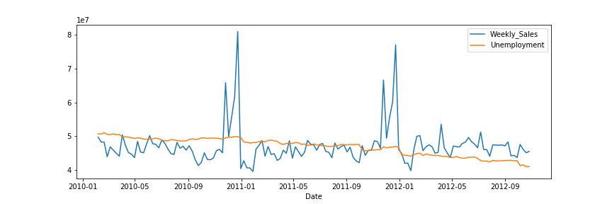

# Retail_Analytics
## Goal
Analyse data from a retailer and predict departement-wide sales for each store.

## Data Source
The data can be downloaded from [Kaggle](https://www.kaggle.com/manjeetsingh/retaildataset).

If you want to run the code, please note that the files have been renamed (Features data set -> features, sales data-set -> sales, stores data-set -> stores)

## Approach
1. Screen data
2. Transform data (cast datatypes, clean up, select relevant)
3. Join data
4. Plot data for feature correlation analysis
5. Choose apropriate model
6. Evaluate predictions

## Results
After cleaning the data and casting correct datatypes, I decided to plot distinct features in order to see whether there's a correlation as this would indicate which model to use for the predictions.

Most of the features did not correlate with the weekly sales as shown in the following figure which compares weekly sales to the unemployment rate:

There seems to be a seasonal trend, though as illustrated in the following figure which compares the weekly sales over the given years:

As there are no straightforward features which could be used for a feature-based model, I decided to use a time-series approach and implemented exponential smoothing (Holt Winters) using a statistical model. 

Using a ratio of 100 entries for training and the remaining 43 entries for testing, the mean absolute percentage error is 2.66%.
Allowing more samples in the training data, i.e. 130 and using the remaining 13 entries for testing resulted in an error of 1.48%. 

